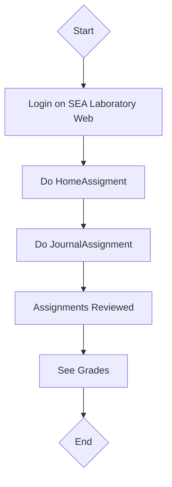

SEA Learning Module System
===
The **SEA Laboratory Web Application** is an innovative learning module system designed specifically to streamline practicum sessions in the SEA program. Initially developed by the 7th Generation of SEA, the application has been actively used since the 8th Generation and continues to support current practicum activities.

This platform was created with the purpose of simplifying the management of practicum journals and documents, allowing both students and instructors to easily access, submit, and review all necessary materials. The web app provides an intuitive interface for organizing practicum sessions, ensuring a smoother, more efficient learning experience for all participants.

Its user-friendly design helps reduce the administrative workload, improves document management, and enhances the overall practicum workflow. With this system, users can track progress, manage submissions, and keep a detailed log of their practicum activities, promoting better learning outcomes and streamlined collaboration.

# User Manual

## Table of Contents

1. SEA Learning Module System
2. [User Manual](https://github.com/sealabtelu/sealab-web-gen7/blob/sealab/README.md#user-manual)
    <br>2.1 [User Guide](https://github.com/sealabtelu/sealab-web-gen7/blob/sealab/README.md#user-guide)
    <br>2.2 [User Flows](https://github.com/sealabtelu/sealab-web-gen7/blob/sealab/README.md#user-flows)
    <br>2.3 [Appendix & FAQ](https://github.com/sealabtelu/sealab-web-gen7/blob/sealab/README.md#appendix-and-faq)<br>
3. [Techninal Troubleshoot](https://github.com/sealabtelu/sealab-web-gen7/blob/sealab/README.md#technical-troubleshoot)

## User Guide
If you are currently participating in the practicum at SEA Laboratory, you can get started right here:

1. Visit [SEA Laboratory Web](https://sealab-telu.com)
2. Click "Login"
3. Enter your Username and Password
4. You are now ready to join the Practicum Session in SEA Laboratory!


User flows
---
Practicum participants are required to complete every assignment given throughout the session.

1. **Home Assignment**
   The home assignment is a task given several days before the practicum session begins. Assignment details are announced on SEA's Instagram and Official Line Account.


2. **Journal Assignment**
   The journal assignment is completed during the practicum session. It serves as both an exercise and a test of what has been learned during the practicum and from the previous home assignment.


After the practicum session is finished, the laboratory assistant will review and grade the assignments. Once grading is completed, participants can view their grades in the Score section.


Here is the overall user flow in brief:


## Appendix and FAQ

1. **My Username/Password are incorrect**  
   - Double-check to ensure you have entered them correctly.  
   - If you suspect your data wasn't registered or you've forgotten your Username/Password, please contact SEA's Official Line Account for assistance.

2. **Can't upload files**  
   - You may need to compress your file if its size exceeds the upload limit. (Max: 1MB)  
   - Also, check your internet connection and try refreshing the web page.

3. **I uploaded the wrong files**  
   If you accidentally upload the wrong files, please contact SEA's Official Line Account for assistance. 
   *Note: if you do it frequently, further mistakes may not be excused.*

4. **I am unhappy with my grade**  
   There are several reasons your grade may be lower than expected:  
   - You used AI for your work, which is prohibited.  
   - You copied a friend’s work, which is considered plagiarism.  
   - You completed the assignment, but your work did not meet the requirements outlined in the task.

# Technical Troubleshoot
## Konfigurasi VPS untuk Website Sealab
Berikut adalah langkah-langkah untuk mengkonfigurasi Virtual Private Server (VPS) untuk menjalankan website Sealab.
> Pastikan API sudah dikonfigurasi sebelumnya.

## Instalasi Node.js
> Node.js yang di instal harus versi **^18.x**
```bash
sudo apt-get install -y ca-certificates curl gnupg
sudo mkdir -p /etc/apt/keyrings
curl -fsSL https://deb.nodesource.com/gpgkey/nodesource-repo.gpg.key | sudo gpg --dearmor -o /etc/apt/keyrings/nodesource.gpg
NODE_MAJOR=18
echo "deb [signed-by=/etc/apt/keyrings/nodesource.gpg] https://deb.nodesource.com/node_$NODE_MAJOR.x nodistro main" | sudo tee /etc/apt/sources.list.d/nodesource.list
sudo apt-get install nodejs
```
setelah instalasi ketik `node -v` dan pastikan versi sudah **^18.x**

## Instalasi npm dan Yarn
Untuk website ini `yarn` lebih direkomendasikan sebagai package manager dibanding `npm`
```
sudo apt-get install npm
npm install --global yarn
```
setelah install ketik `yarn -v` untuk memeriksa apakah `yarn` sudah terinstall

Buat file konfigurasi baru untuk situs web di `/etc/nginx/sites-available` dengan nama `sealab-telu.com` lalu isi dengan kode berikut

```
server {
    listen 80;
    server_name sealab-telu.com;

    location / {
        proxy_pass http://localhost:4173;
    }
}
```
Aktifkan konfigurasi dengan membuat link simbolis ke direktori `/etc/nginx/sites-enabled` dengan kode berikut
``` bash
ln -s /etc/nginx/sites-available/sealab-telu.com /etc/nginx/sites-enabled/
```

## Menjalankan aplikasi
Gunakan terminal multiplexer seperti `tmux` untuk menjalankan website secara terus menerus:
```bash
tmux new -s sea-web
tmux a -t sea-web
cd sealab-web
```
Sebelum menjalankan aplikasi setting dulu `.env` sesuai dengan contoh di `.env.example` kemudian untuk menjalankan web ketik:

```bash
chmod +x deploy.sh
./deploy.sh
```
